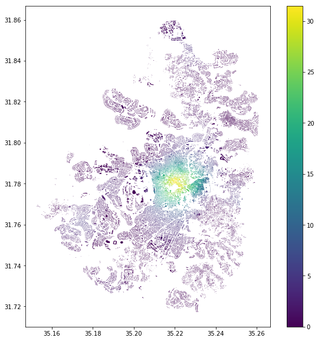

# Network Analysis Course

## Syllabus
http://www4.huji.ac.il/htph/shnaton/index.php/NewSyl/40892/2/2019/

**Network analysis - 40892**
 Last update 24-02-2019

*HU Credits:* 2

*Degree/Cycle: 2nd degree (Master)*

*Responsible Department:* Geography

*Academic year:* 0

*Semester:* 2nd Semester

*Teaching Languages:* Hebrew

*Campus:* Mt. Scopus

*Course/Module Coordinator:* Dr. Michal Lichter

*Coordinator Email:* Michal.Lichter@mail.huji.ac.il

*Coordinator Office Hours:*

*Teaching Staff:*  Dr. Michal Lichter

*Course/Module description:*
The course will review selected topics in network analysis with an emphasis on
 spatial applications in a GIS (Geographic Information System). In the course,
students will learn to analyze real world data and use NetworkX and other python
libraries.

*Course/Module aims:*
Acquiring knowledge and skills to analyse networks

*Learning outcomes - On successful completion of this module, students should be
able to:*
 * Describe what are networks and explain basic network theory concepts
* Represent networks in different ways and describe the benefits and drawbacks of
each
* Analyse network using different python libraries
* Characterise networks using various measures
* Apply and perform various analyses on different types of networks
*Attendance requirements(%):
 80
 
*Teaching arrangement and method of instruction:*

*Course/Module Content:*

presentations: https://drive.google.com/drive/folders/1YfkPq4rDZryyUJcRhitU2t31aBSy5xH1?usp=sharing

 * Introduction
   * General concepts
 * Network types
 * Paths
   * Depth First Search (DFS)
   * Breadth First Search (BFS)
   * Shortest path problem
   * Dijkstra
 * Network Properties
   * Distance measures
   * Clustering Coefficient
   * Connected Components
 * Social Networks and centrality and influence measures
 * Road and transportation networks and accessibility and connectivity measures
 * Route problems
   * Seven bridges of Königsberg
   * Traveling salesman problem 

*Required Reading:*
 * NetworkX:
https://networkx.github.io/documentation/stable/index.html
 * OSMnx:
https://github.com/gboeing/osmnx
https://github.com/gboeing/osmnx-examples/tree/master/notebooks
 * Gephi:
Home page:
https://gephi.org/

*List of tutorials:*
 * https://seinecle.github.io/gephi-tutorials/
 * Youtube lecture:
https://www.youtube.com/watch?v2FqM4gKeNO4
 * ArcGIS network analyst tutorial:
https://desktop.arcgis.com/en/arcmap/latest/extensions/network-analyst/about-thenetwork-analyst-tutorial-exercises.htm

*Python resources:*
 * Graphs in Python:
https://www.python-course.eu/graphs_python.php
https://www.python.org/doc/essays/graphs/
DFS, BFS:
https://www.tutorialspoint.com/python/python_graph_algorithms.htm

*General python:*
https://interactivepython.org/courselib/static/thinkcspy/index.html

*Additional Reading Material:*
 * https://www.cs.cornell.edu/home/kleinber/networks-book/
 

* http://math-wiki.com/index.php?title%D7%AA%D7%A7%D7%A6%D7%99%D7%A8_
%D7%AA%D7%95%D7%A8%D7%AA_%D7%94%D7%92%D7%A8%D7%A4%D7%99
%D7%9D,_%D7%A1%D7%9E%D7%A1%D7%98%D7%A8_%D7%90_%D7%AA%D7%
A9%D7%A2%D7%B4%D7%92

 * http://math.eitan.ac.il/graph_theory/Misc/home.htm

 *Course/Module evaluation:*
  * End of year written/oral examination 0 %
   * Presentation 0 %
   * Participation in Tutorials 0 %
   * Project work 0 %
   * Assignments 100 %
   * Reports 0 %
   * Research project 0 %
   * Quizzes 0 %
   * Other 0 %

